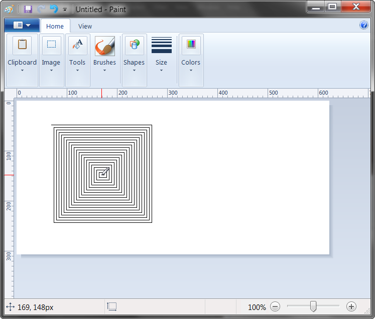

.. default-role:: code

============
Introduction
============

Purpose
=======

The purpose of PyAutoGUI is to provide a cross-platform Python module for GUI automation *for human beings*. The API is designed to be as simple as possible with sensible defaults.

For example, here is the complete code to move the mouse to the middle of the screen on Windows, OS X, and Linux:

.. code:: python

    >>> import pyautogui
    >>> screenWidth, screenHeight = pyautogui.size()
    >>> pyautogui.moveTo(screenWidth / 2, screenHeight / 2)

And that is all.

PyAutoGUI can simulate moving the mouse, clicking the mouse, dragging with the mouse, pressing keys, pressing and holding keys, and pressing keyboard hotkey combinations.

Examples
========

.. code:: python

    >>> import pyautogui
    >>> screenWidth, screenHeight = pyautogui.size()
    >>> currentMouseX, currentMouseY = pyautogui.position()
    >>> pyautogui.moveTo(100, 150)
    >>> pyautogui.click()
    >>> pyautogui.moveRel(None, 10)  # move mouse 10 pixels down
    >>> pyautogui.doubleClick()
    >>> pyautogui.moveTo(500, 500, duration=2, tween=pyautogui.tweens.easeInOutQuad)  # use tweening/easing function to move mouse over 2 seconds.
    >>> pyautogui.typewrite('Hello world!', interval=0.25)  # type with quarter-second pause in between each key
    >>> pyautogui.press('esc')
    >>> pyautogui.keyDown('shift')
    >>> pyautogui.press(['left', 'left', 'left', 'left', 'left', 'left'])
    >>> pyautogui.keyUp('shift')
    >>> pyautogui.hotkey('ctrl', 'c')

This example drags the mouse in a square spiral shape in MS Paint (or any graphics drawing program):

.. code:: python

    >>> distance = 200
    >>> while distance > 0:
            pyautogui.dragRel(distance, 0, duration=0.5)   # move right
            distance -= 5
            pyautogui.dragRel(0, distance, duration=0.5)   # move down
            pyautogui.dragRel(-distance, 0, duration=0.5)  # move left
            distance -= 5
            pyautogui.dragRel(0, -distance, duration=0.5)  # move up

Dependencies
============

On Windows, PyAutoGUI has no dependencies (other than Pillow and some other modules, which are installed by pip along with PyAutoGUI). It does **not** need the ``pywin32`` module installed since it uses Python's own ``ctypes`` module.

On OS X, PyAutoGUI requires PyObjC_ installed for the AppKit and Quartz modules. The module names on PyPI to install are ``pyobjc-core`` and ``pyobjc`` (in that order).

.. _PyObjC: http://pythonhosted.org/pyobjc/install.html

On Linux, PyAutoGUI requires ``python-xlib`` (for Python 2) or ``python3-Xlib`` (for Python 3) module installed.

Fail-Safes
==========

Like the enchanted brooms from the Sorcerer’s Apprentice programmed to keep filling (and then overfilling) the bath with water, your program could get out of control (even though it is following your instructions) and need to be stopped. This can be difficult to do if the mouse is moving around on its own, preventing you from clicking on the program's window to close it down.

As a safety feature, a fail-safe feature is enabled by default. When `pyautogui.FAILSAFE = True` PyAutoGUI functions will raise a `pyautogui.FailSafeException` if the mouse cursor is in the upper left corner of the screen. If you lose control and need to stop the current PyAutoGUI function, keep moving the mouse cursor up and to the left. To disable this feature, set `FAILSAFE` to `False`:

    >>> import pyautogui
    >>> pyautogui.FAILSAFE = False # disables the fail-safe

You can add delays after all of PyAutoGUI's functions by setting the ``pyautogui.PAUSE`` variable to a float or integer value of the number of seconds to pause. By default, the pause is set to 0.1 seconds. This can be helpful when interacting with other applications so that PyAutoGUI doesn't move too fast for them. For example:

    >>> import pyautogui
    >>> pyautogui.PAUSE = 2.5
    >>> pyautogui.moveTo(100, 100); pyautogui.click()   # there will be a two and a half second pause after moving and another after the click

All PyAutoGUI functions will block until they complete. (It is on the roadmap to add an optional non-blocking way to call these functions.)

**It is advised to use FAILSAFE along with setting PAUSE.**