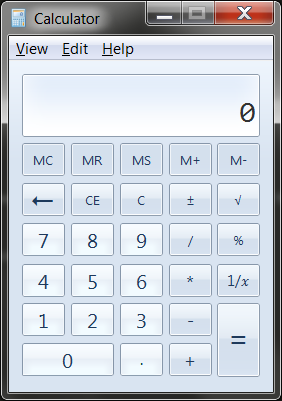

.. default-role:: code

====================
Screenshot Functions
====================

PyAutoGUI can take screenshots, save them to files, and locate images within the screen. This is useful if you have a small image of, say, a button that needs to be clicked and want to locate it on the screen. These features are provided by the PyScreeze module, which is installed with PyAutoGUI.

Screenshot functionality requires the Pillow module. OS X uses the `screencapture` command, which comes with the operating system. Linux uses the `scrot` command, which can be installed by running `sudo apt-get install scrot`.

The screenshot() Function
=========================

Calling `screenshot()` will return an Image object (see the Pillow or PIL module documentation for details). Passing a string of a filename will save the screenshot to a file as well as return it as an Image object.

.. code:: python

    >>> import pyautogui
    >>> im1 = pyautogui.screenshot()
    >>> im2 = pyautogui.screenshot('my_screenshot.png')

On a 1920 x 1080 screen, the `screenshot()` function takes roughly 100 milliseconds - it's not fast but it's not slow.

There is also an optional `region` keyword argument, if you do not want a screenshot of the entire screen. You can pass a four-integer tuple of the left, top, width, and height of the region to capture:

    >>> import pyautogui
    >>> im = pyautogui.screenshot(region=(0,0, 300, 400))

The Locate Functions
====================

NOTE: As of version 0.9.41, if the locate functions can't find the provided image, they'll raise `ImageNotFoundException` instead of returning `None`.

You can visually locate something on the screen if you have an image file of it. For example, say the calculator app was running on your computer and looked like this:

You can't call the `moveTo()` and `click()` functions if you don't know the exact screen coordinates of where the calculator buttons are. The calculator can appear in a slightly different place each time it is launched, causing you to re-find the coordinates each time. However, if you have an image of the button, such as the image of the 7 button:

. . . you can call the `locateOnScreen('calc7key.png')` function to get the screen coordinates. The return value is a 4-integer tuple: (left, top, width, height). This tuple can be passed to `center()` to get the X and Y coordinates at the center of this region. If the image can't be found on the screen, `locateOnScreen()` raises `ImageNotFoundException`.

    >>> import pyautogui
    >>> button7location = pyautogui.locateOnScreen('calc7key.png')
    >>> button7location
    Box(left=1416, top=562, width=50, height=41)
    >>> button7location[0]
    1416
    >>> button7location.left
    1416
    >>> button7point = pyautogui.center(button7location)
    >>> button7point
    Point(x=1441, y=582)
    >>> button7point[0]
    1441
    >>> button7point.x
    1441
    >>> button7x, button7y = button7point
    >>> pyautogui.click(button7x, button7y)  # clicks the center of where the 7 button was found
    >>> pyautogui.click('calc7key.png') # a shortcut version to click on the center of where the 7 button was found

The optional `confidence` keyword argument specifies the accuracy with which the function should locate the image on screen. This is helpful in case the function is not able to locate an image due to negligible pixel differences:

    >>> import pyautogui
    >>> button7location = pyautogui.locateOnScreen('calc7key.png', confidence=0.9)
    >>> button7location
    Box(left=1416, top=562, width=50, height=41)

**Note**: You need to have `OpenCV <https://pypi.org/project/opencv-python/>`_ installed for the `confidence` keyword to work.

The `locateCenterOnScreen()` function combines `locateOnScreen()` and `center()`:

    >>> import pyautogui
    >>> x, y = pyautogui.locateCenterOnScreen('calc7key.png')
    >>> pyautogui.click(x, y)

On a 1920 x 1080 screen, the locate function calls take about 1 or 2 seconds. This may be too slow for action video games, but works for most purposes and applications.

There are several "locate" functions. They all start looking at the top-left corner of the screen (or image) and look to the right and then down. The arguments can either be a

- `locateOnScreen(image, grayscale=False)` - Returns (left, top, width, height) coordinate of first found instance of the `image` on the screen. Raises `ImageNotFoundException` if not found on the screen.

- `locateCenterOnScreen(image, grayscale=False)` - Returns (x, y) coordinates of the center of the first found instance of the `image` on the screen. Raises `ImageNotFoundException` if not found on the screen.

- `locateAllOnScreen(image, grayscale=False)` - Returns a generator that yields (left, top, width, height) tuples for where the image is found on the screen.

- `locate(needleImage, haystackImage, grayscale=False)` - Returns (left, top, width, height) coordinate of first found instance of `needleImage` in `haystackImage`. Raises `ImageNotFoundException` if not found on the screen.

- `locateAll(needleImage, haystackImage, grayscale=False)` - Returns a generator that yields (left, top, width, height) tuples for where `needleImage` is found in `haystackImage`.

The "locate all" functions can be used in for loops or passed to `list()`:

    >>> import pyautogui
    >>> for pos in pyautogui.locateAllOnScreen('someButton.png')
    ...   print(pos)
    ...
    (1101, 252, 50, 50)
    (59, 481, 50, 50)
    (1395, 640, 50, 50)
    (1838, 676, 50, 50)
    >>> list(pyautogui.locateAllOnScreen('someButton.png'))
    [(1101, 252, 50, 50), (59, 481, 50, 50), (1395, 640, 50, 50), (1838, 676, 50, 50)]

These "locate" functions are fairly expensive; they can take a full second to run. The best way to speed them up is to pass a `region` argument (a 4-integer tuple of (left, top, width, height)) to only search a smaller region of the screen instead of the full screen:

    >>> import pyautogui
    >>> pyautogui.locateOnScreen('someButton.png', region=(0,0, 300, 400))

Grayscale Matching
------------------

Optionally, you can pass `grayscale=True` to the locate functions to give a slight speedup (about 30%-ish). This desaturates the color from the images and screenshots, speeding up the locating but potentially causing false-positive matches.

    >>> import pyautogui
    >>> button7location = pyautogui.locateOnScreen('calc7key.png', grayscale=True)
    >>> button7location
    (1416, 562, 50, 41)

Pixel Matching
--------------

To obtain the RGB color of a pixel in a screenshot, use the Image object's `getpixel()` method:

    >>> import pyautogui
    >>> im = pyautogui.screenshot()
    >>> im.getpixel((100, 200))
    (130, 135, 144)

Or as a single function, call the `pixel()` PyAutoGUI function, which is a wrapper for the previous calls:

    >>> import pyautogui
    >>> pix = pyautogui.pixel(100, 200)
    >>> pix
    RGB(red=130, green=135, blue=144)
    >>> pix[0]
    130
    >>> pix.red
    130

If you just need to verify that a single pixel matches a given pixel, call the `pixelMatchesColor()` function, passing it the X coordinate, Y coordinate, and RGB tuple of the color it represents:

    >>> import pyautogui
    >>> pyautogui.pixelMatchesColor(100, 200, (130, 135, 144))
    True
    >>> pyautogui.pixelMatchesColor(100, 200, (0, 0, 0))
    False

The optional `tolerance` keyword argument specifies how much each of the red, green, and blue values can vary while still matching:

    >>> import pyautogui
    >>> pyautogui.pixelMatchesColor(100, 200, (130, 135, 144))
    True
    >>> pyautogui.pixelMatchesColor(100, 200, (140, 125, 134))
    False
    >>> pyautogui.pixelMatchesColor(100, 200, (140, 125, 134), tolerance=10)
    True
